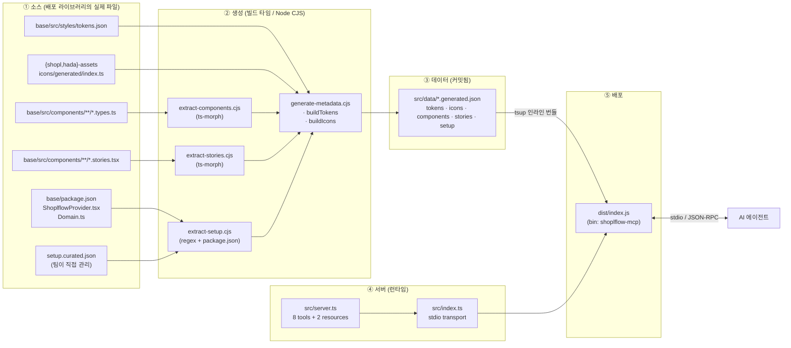

# @shoplflow/mcp 아키텍쳐

> AI 코딩 에이전트에게 shoplflow 디자인 시스템을 노출하는 MCP(Model Context Protocol) 서버의 내부 구조 문서.
> 사용법은 [README.md](./README.md)를 참고하세요. 이 문서는 **왜 이렇게 만들었는지 / 어디를 고쳐야 하는지**를 다룹니다.

---

## 1. 이 패키지가 푸는 문제

에이전트(Claude Code, Cursor, Codex …)에게 "shoplflow로 UI 만들어줘"라고 하면, 학습 데이터에 없는 사내 디자인 시스템이므로 **토큰 이름·컴포넌트 prop·아이콘 이름을 지어냅니다.**

```tsx
// 에이전트가 흔히 만들어내는 코드 (전부 존재하지 않음)
<Button variant="primary" size="medium" color="#3B82F6" />
<Icon name="plus" />
```

MCP 서버는 **실제로 배포되는 라이브러리에서 추출한 메타데이터**를 툴로 노출해서, 에이전트가 추측 대신 조회하도록 만듭니다.

```tsx
// 조회 후 생성되는 코드
<Button styleVar="PRIMARY" sizeVar="M" />
<Icon iconSource={AddIcon} sizeVar="S" color="neutral500" />
```

---

## 2. 핵심 설계 원칙

| 원칙                                  | 구현                                                                                                             | 이유                                                                                        |
| ------------------------------------- | ---------------------------------------------------------------------------------------------------------------- | ------------------------------------------------------------------------------------------- |
| **드리프트 구조적 차단**              | 메타데이터를 손으로 쓰지 않고 **빌드 타임에 라이브러리 소스에서 추출**                                           | 손으로 관리하면 반드시 실제 코드와 어긋남. 추출이면 어긋날 수가 없음                        |
| **단일 출처(Single Source of Truth)** | 배포되는 라이브러리를 만드는 **바로 그 파일들**을 읽음 (`tokens.json`, `*.types.ts`, `*.stories.tsx`, 에셋 배럴) | 별도 문서/스키마를 두면 그것 자체가 또 하나의 드리프트 지점                                 |
| **런타임 얇게**                       | 서버는 필터·스코어링만 수행. 파싱/AST 분석은 전부 빌드 타임                                                      | 툴 호출 지연 최소화, 런타임 의존성 최소화(`@modelcontextprotocol/sdk` + `zod`뿐)            |
| **파일 조회 없는 단일 바이너리**      | tsup의 `loader: { '.json': 'json' }`로 데이터를 **번들에 인라인**                                                | `npx -y @shoplflow/mcp` 한 줄로 동작. 경로 해석 실패·누락 파일 이슈 없음                    |
| **큐레이션은 딱 한 파일**             | 사람이 판단해야 하는 내용만 `setup.curated.json`에 격리                                                          | 팀이 어디를 고쳐야 하는지 명확. 나머지는 건드릴 필요가 없음                                 |
| **생성 결과물을 커밋**                | `src/data/*.generated.json`을 git에 추적                                                                         | 재현 가능한 배포 + PR diff에서 "라이브러리 변경이 메타데이터에 어떻게 반영됐는지" 리뷰 가능 |

---

## 3. 전체 구조



### 디렉터리 맵

```
packages/mcp/
├── setup.curated.json          ★ 팀이 직접 관리하는 유일한 파일
├── scripts/
│   ├── generate-metadata.cjs   오케스트레이터 + 토큰/아이콘 빌더
│   ├── extract-components.cjs  Phase 3 · ts-morph로 *.types.ts → API 카드
│   ├── extract-stories.cjs     Phase 4 · ts-morph로 *.stories.tsx → 사용 예제
│   ├── extract-setup.cjs       Phase 5 · AUTO(코드) + CURATED(사람) 병합
│   ├── check-release-wiring.cjs  릴리즈 연동 3대 불변식 검증 (CI + 로컬)
│   └── smoke.mjs               실제 MCP 클라이언트로 dist 서버 검증
├── src/
│   ├── data/*.generated.json   ← 생성물 (커밋 대상, 직접 편집 금지)
│   ├── server.ts               툴·리소스 등록 + 검색 스코어링
│   └── index.ts                stdio 부트스트랩
└── tsup.config.ts              ESM · node18 · JSON 인라인 · shebang
```

---

## 4. 레이어별 상세

### ① 소스 레이어 — 무엇을 읽는가

| 소스                                                        | 읽는 주체                | 산출물                                | 읽는 방식                             |
| ----------------------------------------------------------- | ------------------------ | ------------------------------------- | ------------------------------------- |
| `base/src/styles/tokens.json`                               | `buildTokens()`          | `tokens.generated.json`               | Tokens Studio 익스포트 JSON 트리 순회 |
| `{shopl,hada}-assets/src/icons/generated/index.ts`          | `buildIcons()`           | `icons.generated.json`                | `export { … }` 블록 정규식 파싱       |
| `base/src/components/**/*.types.ts`                         | `extract-components.cjs` | `components.generated.json`           | ts-morph AST (타입체커 미사용)        |
| `base/src/components/**/*.stories.tsx`                      | `extract-stories.cjs`    | `stories.generated.json`              | ts-morph AST                          |
| `base/package.json` · `ShoplflowProvider.tsx` · `Domain.ts` | `extract-setup.cjs`      | `setup.generated.json` (AUTO 파트)    | 정규식 + `exports` 필드               |
| `setup.curated.json`                                        | `extract-setup.cjs`      | `setup.generated.json` (CURATED 파트) | 그대로 병합                           |

> **모노레포 상대 경로로 직접 읽습니다** (`../../base/src/...`). `node_modules`가 아니라 워크스페이스 소스를 가리키므로, base 소스가 바뀌면 다음 추출에서 즉시 반영됩니다. 워크스페이스 의존성(`@shoplflow/base` 등)이 `devDependencies`에 선언된 이유는 런타임 사용이 아니라 **빌드 순서 보장 + 릴리즈 연동**입니다 — 아래 6절 참고.

### ② 생성 레이어 — 5개의 빌더

`generate-metadata.cjs`가 오케스트레이터입니다. 토큰·아이콘은 로직이 짧아 이 파일 안에 있고, AST가 필요한 3개는 별도 모듈로 분리했습니다.

#### `buildTokens()` — 토큰

`packages/base/scripts/seperate-tokens.cjs`(라이브러리 본체의 토큰 생성기)와 **같은 규칙**으로 트리를 나눕니다.

- `shoplflow` 루트 → `shared` 도메인 (팔레트·spacing·radius·fontWeight·shadow)
- `shopl` / `hada` → 브랜드별 타이포그래피 + primary/semantic 컬러
- `$themes` / `$metadata` → 무시

타입별로 **소비 방식이 다르다는 점**이 레코드에 인코딩됩니다:

| `type`                     | 값 처리                                                   | 노출 필드                                                                      |
| -------------------------- | --------------------------------------------------------- | ------------------------------------------------------------------------------ |
| `color`                    | `{group.name}` 별칭을 실제 리터럴로 해석 (`resolveColor`) | `cssVar: --{name}`                                                             |
| `spacing` / `borderRadius` | 숫자 → `"16px"`                                           | `cssVar` (radius는 kebab-case)                                                 |
| `fontWeights`              | 문자열화                                                  | `cssVar: --font-weight-{name}`                                                 |
| `typography`               | 객체 그대로                                               | **`className: .{name}`** — CSS 변수가 아니라 클래스/`typography` prop으로 소비 |
| `boxShadow` / `dropShadow` | `x y blur spread color` 문자열로 평탄화                   | —                                                                              |

> 타이포그래피만 `cssVar`가 아니라 `className`인 이유: 라이브러리에서 `<Text typography="body1_700" />` 형태로 쓰기 때문입니다. 이 구분이 없으면 에이전트가 `var(--body1_700)` 같은 존재하지 않는 CSS를 씁니다.

현재 산출: **114개** (color 44 · typography 47 · spacing 13 · borderRadius 6 · fontWeights 3 · boxShadow 1 / shared 55 · shopl 30 · hada 29)

#### `buildIcons()` — 아이콘

에셋 패키지의 배럴 파일이 공개 아이콘 이름의 출처입니다.

```ts
export { IcAdd as AddIcon, IcInfo as InfoIcon, … };
//        ^raw name  ^public alias  — 둘 다 import 가능하므로 둘 다 노출
```

이름을 단어로 쪼개 검색 키워드를 만듭니다: `IcAiChatBot` → `["ai", "chat", "bot"]` (`Ic` 접두사 제거 후 camelCase 분해).

현재 산출: **473개** (shopl 369 · hada 104). **브랜드마다 아이콘 세트가 다르므로** `domain` 필터가 중요합니다.

#### `extract-components.cjs` — 컴포넌트 API (가장 복잡)

라이브러리는 `utils/type/ComponentProps.ts`의 mixin을 조합해 props를 만듭니다. 추출기는 이 조합 규칙을 재현합니다.

```
1. mixin 파일을 한 번 파싱 → registry (인터페이스명 → props + JSDoc)
2. 각 export된 `*Props`에 대해 intersection / heritage를 전개
3. SizeVariantProps<T> / StyleVariantProps<T> / IconSizeVariantProps<T>를
   그 T를 만들어내는 `as const` 객체에 연결 → 정확한 variant 값 확보
4. 다형성(`as`) · 네이티브 HTML 속성 전달 여부를 플래그로 표시
```

핵심은 **`expandRef()` 단일 디스패처**입니다. 인터페이스의 `extends`와 타입 별칭의 `&`가 같은 경로로 처리되므로 두 문법이 동일하게 해석됩니다.

| 참조 이름                                                         | 처리                                                                      |
| ----------------------------------------------------------------- | ------------------------------------------------------------------------- |
| `SizeVariantProps` / `StyleVariantProps` / `IconSizeVariantProps` | variant로 등록 + 타입 인자를 `as const` enum까지 추적해 실제 값 배열 확보 |
| `PolymorphicComponentProps` / `RenderConfigProps` / `AsProp`      | `polymorphic: true` (+ 2번째 타입 인자 재귀 전개)                         |
| `HTMLAttributes`, `ComponentPropsWithoutRef` 등 8종               | `nativeAttrs` 플래그 — prop을 나열하지 않음 (수백 개가 되어 무의미)       |
| `Omit<X, …>`                                                      | X를 전개 (제외 목록은 무시)                                               |
| registry에 있는 mixin                                             | props 병합                                                                |
| 같은 파일의 로컬 인터페이스/별칭                                  | 재귀 전개 (`seen` 셋으로 순환 차단)                                       |

필터: `*Props`로 끝나되 `*OptionProps` / `*GenericProps` / `*StyledProps`는 제외 (내부 빌딩 블록).

> **타입체커를 쓰지 않습니다.** AST만 읽으므로 빠르고, `base`가 컴파일 가능한 상태가 아니어도 동작합니다. 대가로 복잡한 조건부 타입은 원문 텍스트로만 노출되며 80자에서 잘립니다(`MAX_TYPE_LEN`).

현재 산출: **65개 카드 / 43개 모듈**, 그중 19개가 variant 보유. 복합 컴포넌트는 파트 단위로 분리됩니다 (`ModalContainer`, `ModalHeader`, …).

#### `extract-stories.cjs` — 사용 예제

스토리는 "실제로 동작하는 사용법"의 최고 출처입니다. 신호는 남기고 테스트 노이즈는 버립니다.

| 스토리 필드                        | 처리                                     |
| ---------------------------------- | ---------------------------------------- |
| `args`                             | 유지 (현실적인 prop 조합) — 600자 클립   |
| `render`                           | 유지 — 반환 JSX만 추출, 1200자 클립      |
| 함수형 스토리(CSF2)                | 함수 본문의 `return` 표현식 추출         |
| `play` / `parameters` / `argTypes` | **버림** (인터랙션 테스트·스토리북 설정) |

모듈당 최대 8개(`MAX_EXAMPLES`). `satisfies` / `as` / 괄호 래퍼는 `unwrap()`으로 벗겨 실제 표현식에 도달합니다.

현재 산출: **42개 모듈 / 149개 예제**.

#### `extract-setup.cjs` — 셋업 & 환경 (AUTO + CURATED)

이 빌더만 **두 종류의 출처를 병합**합니다.

```
AUTO (코드에서 추출 → 절대 드리프트 없음)
  provider 이름 / domain 기본값 / DomainType 값들   ← ShoplflowProvider.tsx, Domain.ts
  CSS import 스펙파이어                              ← base/package.json exports 중 *.css
  peerDependencies                                   ← base/package.json
  client-only 사유                                   ← provider의 import 문에서 유도
                                                       (framer-motion / Portal / useDomain / Emotion)
  snippet                                            ← 위 사실들로 합성 ⇒ 잘못된 import를 쓸 수 없음
CURATED (setup.curated.json — 사람의 판단)
  setupSteps / environments(프레임워크별 지원 상태·워크어라운드) / instructions
```

> **snippet을 합성하는 이유**: 예제를 손으로 쓰면 import 경로나 prop이 실제와 어긋날 수 있습니다. 추출한 사실로 조립하면 구조적으로 불가능합니다.

### ③ 데이터 레이어 — 스키마

모든 파일은 `{ source, count, …통계, <배열> }` 형태입니다. `source` 필드는 "이 데이터가 어디서 왔는지"를 기록해 디버깅 시 소스를 되짚을 수 있게 합니다.

```ts
TokenRecord   { name, type, domain, path, value, cssVar, className }
IconRecord    { name, alias, domain, importFrom, keywords[] }
ComponentCard { name, group, importFrom, polymorphic, defaultElement?, nativeAttrs?,
                variants: [{ prop, values[] }], props: [{ name, optional, type, description? }] }
StoryModule   { name, group, title?, importFrom, examples: [{ story, args?, code? }] }
Setup         { provider, styles[], peerDependencies, setupSteps[], snippet,
                environments[], instructions }
```

### ④ 서버 레이어 — 8 툴 · 2 리소스

`createServer()`가 전부를 등록합니다. 상태가 없으므로 인스턴스는 언제든 새로 만들 수 있습니다(테스트 용이).

```
instructions (연결 시 항상 노출)   ← setup.instructions
  └ "Provider + global CSS 없이는 아무것도 렌더하지 마라 / client-only다"

리소스  shoplflow://tokens       전체 토큰 카탈로그 JSON
        shoplflow://components   컴포넌트 컴팩트 인덱스

툴  탐색형(넓게)          →  상세형(좁게)
    list_tokens          →  get_token
    search_icon
    search_component     →  get_component_api  →  get_usage_example
    get_setup_guide / check_environment
```

**툴 설계 규칙 — "탐색 → 상세" 2단계.** 목록 툴은 요약(`summarize()`)만 반환하고 상세는 별도 툴로 분리했습니다. 65개 컴포넌트의 전체 prop을 한 번에 반환하면 에이전트 컨텍스트를 수만 토큰 잡아먹습니다.

**미스 시 제안(suggestion) 규칙.** `get_token` / `get_component_api` / `get_usage_example`은 못 찾으면 에러 대신 `{ found: false, suggestions: [...] }`를 반환합니다. 에이전트가 오타를 스스로 교정하고 재시도할 수 있게 하기 위함입니다.

**검색 스코어링 — AND 시맨틱.**

```js
// 모든 검색어가 점수에 기여해야 함. 하나라도 0이면 전체 0.
for (const term of terms) {
  const s = score(item, term);
  if (s === 0) return 0;
  total += s;
}
```

다중 단어 질의가 결과를 **넓히는 게 아니라 좁히도록** 만드는 장치입니다. `"chat bot"`은 chat 관련 전부가 아니라 둘 다 만족하는 아이콘만 반환합니다.

|              | 정확 일치      | 키워드 일치 | 부분 문자열        | 그 외                  |
| ------------ | -------------- | ----------- | ------------------ | ---------------------- |
| **아이콘**   | name/alias 100 | keyword 80  | name/alias 60      | keyword 부분일치 40    |
| **컴포넌트** | name 100       | —           | name 60 · group 40 | prop명 30 · variant 20 |

### ⑤ 배포 레이어

```
tsup: entry=src/index.ts · format=esm · target=node18 · platform=node
      loader={'.json':'json'}  ← 데이터를 번들에 인라인
      banner='#!/usr/bin/env node' · dts=false
→ dist/index.js  (package.json bin: shoplflow-mcp)
```

`files: ["dist"]`이므로 npm에는 번들 하나만 올라갑니다. 소비자는 `npx -y @shoplflow/mcp`로 즉시 실행합니다.

---

## 5. 요청 흐름

```
에이전트 시작
  └ MCP 클라이언트가 stdio로 프로세스 spawn (npx -y @shoplflow/mcp)
      └ initialize → 서버가 instructions 반환
          └ 클라이언트가 시스템 프롬프트에 주입 ("Provider/CSS 먼저!")

사용자: "shoplflow로 삭제 버튼 만들어줘"
  ├ search_component("button")        → Button, IconButton, SplitButton …
  ├ get_component_api("Button")       → styleVar: [PRIMARY|SECONDARY|SOLID|GHOST]
  │                                     sizeVar: [S|M|XS], polymorphic, props+JSDoc
  ├ get_usage_example("Button")       → 실제 스토리 기반 JSX
  ├ search_icon("trash")              → IcTrash / TrashIcon, importFrom
  └ list_tokens({type:"color"})       → 정확한 토큰 키
→ 환각 없는 코드 생성
```

> `index.ts`의 로그가 `console.error`인 것은 필수입니다. **stdout은 JSON-RPC 전용**이므로 `console.log`를 쓰면 프로토콜이 깨집니다.

---

## 6. base 릴리즈와의 연동 (가장 중요하고, 가장 안 보이는 부분)

**"base가 릴리즈되면 mcp도 최신 메타데이터로 자동 재배포된다"**는 동작은 어느 한 곳에 선언돼 있지 않습니다. 서로 다른 5개 설정이 맞물려 만들어집니다.

```
base/src 수정
  └ ① 추출기가 그 경로를 직접 읽음         scripts/*.cjs 의 "../../base/src/..." 상대경로
      └ ② 빌드마다 무조건 재추출           package.json: "build:package": "pnpm generate:metadata && … && tsup"
          └ ③ turbo가 스케줄 + 순서 보장   turbo.json: build:package.dependsOn = ["^build:package", …]
              └ ④ changesets가 mcp 범프    mcp devDependencies(workspace:*) + .changeset/config.json
                  │                          "updateInternalDependents": "always"
                  └ ⑤ CI가 순서대로 실행    changesets-workflow.yml: pnpm build → version → publish
```

### ④가 가장 취약합니다

`@shoplflow/base`는 mcp 런타임에 전혀 쓰이지 않습니다. 그래서 "안 쓰는데 왜 devDependencies에 있지?" 하고 지우기 쉽습니다. 지우면:

- 추출은 상대경로라 **계속 정상 동작**하고
- 빌드도 통과하고
- 다만 **changesets가 mcp를 dependent로 인식하지 못해 버전 범프가 멈춥니다**

결과적으로 base가 아무리 바뀌어도 새 mcp가 npm에 올라가지 않고, 소비자는 낡은 메타데이터를 계속 받습니다. **에러가 전혀 나지 않는 조용한 실패**입니다.

실증: `CHANGELOG.md`의 `0.1.1`은 base의 ToggleButton 변경(#819)을 그대로 달고 배포됐습니다 — mcp 코드는 한 줄도 안 바뀐 릴리즈입니다.

### ③도 명시적이지 않습니다

mcp에는 `build` 스크립트가 **없고** `build:package`만 있습니다. 그런데도 루트 `pnpm build`(= `turbo run build`)가 mcp를 빌드합니다 — turbo가 turbo.json의 태스크를 전 패키지에 걸쳐 그래프로 펼치기 때문입니다. 읽어서는 알기 어려운 동작이라 `turbo.json`에 주석을 달아뒀습니다.

### 이 3개를 CI가 검증합니다

`scripts/check-release-wiring.cjs`가 위 불변식을 실행 가능한 형태로 고정합니다.

```bash
pnpm --filter @shoplflow/mcp check:wiring
```

| 검사                      | 깨지면 생기는 일                                             |
| ------------------------- | ------------------------------------------------------------ |
| 워크스페이스 devDeps 존재 | changesets가 mcp를 범프하지 않아 재배포가 멈춤 (조용한 실패) |
| `build:package` 체인      | 스테일 메타데이터로 배포됨                                   |
| turbo가 mcp를 스케줄      | `pnpm build`가 mcp의 dist를 만들지 않음                      |

여기에 더해 `build-test.yml`이 `pnpm build` 직후 `git diff --exit-code packages/mcp/src/data/`로 **커밋된 메타데이터가 최신인지** 확인합니다. 이게 없으면 "생성물을 커밋해서 PR에서 리뷰 가능하게 한다"는 설계 의도가 조용히 무너집니다. (실제로 이 검증을 추가하던 시점에 이미 토큰 1개·아이콘 22개·컴포넌트 2개만큼 밀려 있었습니다.)

---

## 7. 확장 가이드

### 새 툴 추가

1. 데이터가 이미 있으면 `src/server.ts`에 `server.registerTool(...)`만 추가.
2. 새 데이터가 필요하면 → 아래 "새 데이터 소스 추가".
3. `description`은 **에이전트가 읽는 유일한 단서**입니다. "언제 호출해야 하는지"를 명시하세요 (기존 툴들의 서술 톤 참고).
4. `inputSchema`는 zod. 모든 필드에 `.describe()`를 답니다.
5. `scripts/smoke.mjs`에 호출 케이스 추가.

### 새 데이터 소스 추가

1. `scripts/extract-<name>.cjs`에 `build<Name>()`를 만들고 `module.exports`.
2. `generate-metadata.cjs`에서 import → `writeJson('<name>.generated.json', ...)` → 콘솔 요약 한 줄 추가.
3. `src/server.ts`에서 import (tsup가 자동 인라인).
4. 타입 인터페이스를 `server.ts` 상단에 선언.
5. `pnpm --filter @shoplflow/mcp generate:metadata` 실행 후 **생성된 JSON을 커밋** (안 하면 CI가 막습니다).

### 셋업 가이드 문구 수정

`setup.curated.json`만 고칩니다. 특히 `environments`의 Next.js 항목은 라이브러리의 실제 지원 입장과 맞는지 팀이 검증해야 합니다(현재 `verify` 필드에 미검증 표시됨).

---

## 8. 설계 결정 & 트레이드오프

| 결정                      | 대안                        | 선택 이유                                                                                   |
| ------------------------- | --------------------------- | ------------------------------------------------------------------------------------------- |
| 빌드 타임 추출 + 커밋     | 런타임에 소스 파싱          | 소비자 머신에 모노레포가 없음. 번들 인라인이어야 `npx` 한 줄로 동작                         |
| ts-morph AST (타입체커 X) | TS 컴파일러 API 풀 타입체크 | 속도(수십 배) + `base`의 컴파일 상태와 무관하게 동작. 대가: 복잡한 조건부 타입은 텍스트로만 |
| 스토리에서 예제 추출      | 예제를 손으로 작성          | 스토리는 CI에서 렌더되므로 항상 동작이 검증됨. 손으로 쓴 예제는 썩음                        |
| stdio 전송                | HTTP/SSE                    | 로컬 에디터 에이전트가 표준으로 쓰는 방식. 인증·네트워크 불필요                             |
| 목록/상세 툴 분리         | 단일 만능 툴                | 컨텍스트 예산 보호. 에이전트가 필요한 만큼만 가져감                                         |
| AND 스코어링              | OR 스코어링                 | 다중 단어 질의에서 노이즈 폭발 방지                                                         |
| 미스 시 suggestion        | 에러 반환                   | 에이전트의 자가 교정 루프를 가능하게 함                                                     |

---

## 9. 유지보수 체크리스트

### 언제 재생성이 필요한가

`build:package`가 항상 `generate:metadata`를 먼저 돌리므로 배포물은 자동으로 최신입니다. 다만 **커밋된 JSON**은 사람이 갱신해야 하고, PR CI가 이를 강제합니다.

| 변경                                                 | 영향                        |
| ---------------------------------------------------- | --------------------------- |
| `tokens.json` 수정                                   | `tokens.generated.json`     |
| SVG 아이콘 추가/삭제 (`build:assets` 후)             | `icons.generated.json`      |
| `*.types.ts` 수정                                    | `components.generated.json` |
| `*.stories.tsx` 수정                                 | `stories.generated.json`    |
| provider / `base` package.json exports·peerDeps 수정 | `setup.generated.json`      |

갱신 방법:

```bash
pnpm --filter @shoplflow/mcp generate:metadata
git add packages/mcp/src/data
```

### 깨지기 쉬운 지점 (정규식·규약 의존)

| 위치                     | 가정                                                      | 깨지면                             |
| ------------------------ | --------------------------------------------------------- | ---------------------------------- |
| `buildIcons()`           | 배럴이 `export { X as Y, … };` 한 블록                    | 아이콘 0개 (조용히 실패)           |
| `extract-setup.cjs`      | provider가 `const Name =` 형태, `domain = 'SHOPL'` 기본값 | 폴백 문자열로 대체 (조용히 부정확) |
| `extract-setup.cjs`      | `Domain.ts`의 유니온이 작은따옴표 리터럴                  | `domainValues` 빈 배열             |
| `extract-components.cjs` | variant 타입이 `typeof <ConstObject>` 경유                | 해당 variant 값 누락               |
| `extract-components.cjs` | mixin이 `utils/type/ComponentProps.ts`에 존재             | 해당 props 누락                    |

→ 재생성 후 콘솔 요약(`✓ tokens: 114 …`)의 **개수가 급감하지 않았는지** 확인하는 것이 가장 싼 회귀 탐지입니다.

### 알려진 갭

- `server.ts`의 `new McpServer({ name, version: '0.0.0' })`가 하드코딩입니다 — `package.json`의 실제 버전과 무관합니다. 클라이언트에 표시되는 버전 정보가 부정확합니다.
- `type-check` 스크립트가 `tsc --noEmit || true`라 **항상 통과**합니다. 타입 에러가 CI를 막지 않습니다.
- 자동 테스트가 없습니다. `scripts/smoke.mjs`가 유일한 동작 검증이며 수동 실행입니다(`node scripts/smoke.mjs`, 빌드 후).

---

## 10. 관련 문서

- [README.md](./README.md) — 설치·연결·툴 레퍼런스
- [../skills/아키텍쳐.md](../skills/아키텍쳐.md) — 이 서버를 함께 배포하는 스킬/플러그인 패키지
- [../../CLAUDE.md](../../CLAUDE.md) — 모노레포 전체 가이드
