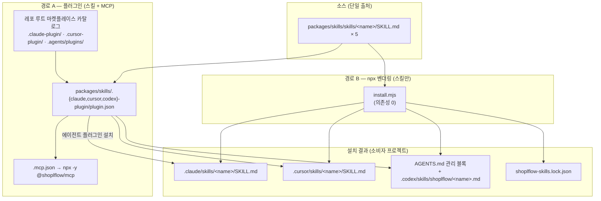

# @shoplflow/skills 아키텍쳐

> shoplflow 디자인 시스템을 **소비하는 개발자**의 AI 에이전트에게 사용법을 가르치는 스킬 패키지 + 플러그인의 내부 구조 문서.
> 사용법은 [README.md](./README.md)를 참고하세요. 이 문서는 **왜 이렇게 만들었는지 / 어디를 고쳐야 하는지**를 다룹니다.

---

## 1. 이 패키지가 푸는 문제

`@shoplflow/mcp`가 **"정확한 사실"**(토큰 값, prop 목록, 아이콘 이름)을 조회로 제공한다면, 스킬은 **"어떻게 쓰는가"**(관용구, 함정, 순서)를 가르칩니다.

에이전트가 툴을 호출하려면 먼저 **"이 프로젝트는 shoplflow를 쓰고, Provider 없이는 아무것도 안 뜬다"**는 것을 알아야 합니다. 그게 스킬의 역할입니다.

### 스킬 ↔ MCP 역할 분담

|         | 스킬 (SKILL.md)                                              | MCP (`@shoplflow/mcp`)                                            |
| ------- | ------------------------------------------------------------ | ----------------------------------------------------------------- |
| 성격    | **정적 지식** — 프롬프트에 주입되는 텍스트                   | **동적 조회** — 툴 호출로 가져오는 데이터                         |
| 담는 것 | 관용구, 셋업 순서, KEY vs VALUE 구분, 함정, 언제 무엇을 쓰나 | 114개 토큰 값, 65개 컴포넌트 API, 473개 아이콘, 149개 스토리 예제 |
| 갱신    | 사람이 작성 → npm 배포 → 벤더링/플러그인 갱신                | 라이브러리 빌드 시 자동 추출                                      |
| 로딩    | 에이전트가 `description` 매칭으로 필요할 때 로드             | 에이전트가 필요할 때 툴 호출                                      |
| 없으면  | 셋업 누락, 잘못된 패턴, "왜 안 뜨지"                         | 토큰/prop 환각                                                    |

**둘은 대체재가 아니라 보완재입니다.** 그래서 플러그인 경로(A)가 둘을 한 번에 설치합니다.

### base 릴리즈 동기화 방식이 정반대입니다

|                | MCP                                      | 스킬                               |
| -------------- | ---------------------------------------- | ---------------------------------- |
| base 변경 반영 | **자동** — 빌드 시 소스에서 재추출       | **수동** — 사람이 SKILL.md 수정    |
| 버전 범프      | **자동** — changesets가 dependent로 범프 | **없음** — base 의존성이 아예 없음 |
| 검증           | CI가 메타데이터 신선도 + 배선 검사       | 없음 (아래 10절 체크리스트에 의존) |

스킬 `package.json`에는 `@shoplflow/*` 의존성이 **하나도 없습니다.** 그래서 changesets가 dependent로 인식하지 못하고, base를 아무리 배포해도 스킬 버전은 그대로입니다. CHANGELOG를 봐도 3개 릴리즈 전부 스킬 자체 변경이고 base발 범프는 한 건도 없습니다.

이건 버그가 아니라 **의도된 설계**입니다 — SKILL.md는 추출물이 아니라 사람이 쓴 판단이라 자동화할 대상이 아닙니다. 다만 그래서 **드리프트 책임이 전적으로 사람에게 있습니다.**

---

## 2. 핵심 설계 원칙

| 원칙                     | 구현                                                              | 이유                                                                         |
| ------------------------ | ----------------------------------------------------------------- | ---------------------------------------------------------------------------- |
| **단일 소스, 다중 타깃** | `skills/<name>/SKILL.md` 하나를 Claude/Cursor/Codex 포맷으로 변환 | 에이전트마다 문서를 따로 쓰면 즉시 어긋남                                    |
| **개방 표준 채택**       | SKILL.md(프론트매터 + 마크다운) 표준 사용                         | Claude Code와 Cursor가 **변환 없이** 그대로 읽음. 어댑터가 필요한 건 Codex뿐 |
| **자기 완결성**          | 스킬은 **공개 npm API만** 참조 (모노레포 내부 경로 없음)          | 소비자 프로젝트에 그대로 복사돼도 유효해야 함                                |
| **의존성 0 인스톨러**    | `install.mjs`가 Node 내장 모듈만 사용                             | `npx`로 즉시 실행. 설치 지연·보안 표면 최소화                                |
| **멱등성**               | 재실행 시 파일 덮어쓰기, Codex는 마커 블록 in-place 교체          | 반복 실행이 안전해야 업데이트 플로우가 성립                                  |
| **버전 스탬프**          | `shoplflow-skills.lock.json` 기록                                 | 벤더링은 자동 갱신이 안 되므로, "낡았는지" 판단할 근거 필요                  |
| **자기 갱신 스킬**       | `shoplflow-skills-update` 스킬이 lock ↔ npm 최신 비교             | 사람이 기억하지 않아도 에이전트가 스스로 체크                                |

---

## 3. 전체 구조



### 디렉터리 맵

```
packages/skills/
├── skills/                       ★ 단일 출처 — 여기만 고치면 모든 경로에 반영
│   ├── shoplflow-setup/SKILL.md
│   ├── shoplflow-components/SKILL.md
│   ├── shoplflow-theming/SKILL.md
│   ├── shoplflow-icons-utils/SKILL.md
│   └── shoplflow-skills-update/SKILL.md
├── install.mjs                   경로 B 인스톨러 (bin: shoplflow-skills)
├── .mcp.json                     Codex 플러그인이 참조하는 MCP 서버 선언
├── .claude-plugin/plugin.json    Claude Code 플러그인 매니페스트 (mcpServers 인라인)
├── .cursor-plugin/plugin.json    Cursor 플러그인 매니페스트 (mcpServers 인라인)
└── .codex-plugin/plugin.json     Codex 플러그인 매니페스트 (mcpServers → ./.mcp.json)

레포 루트 (마켓플레이스 카탈로그 — 에이전트가 여기를 먼저 읽음)
├── .claude-plugin/marketplace.json    source: ./packages/skills
├── .cursor-plugin/marketplace.json    source: packages/skills
└── .agents/plugins/marketplace.json   source: git-subdir → ./packages/skills @ main
```

---

## 4. SKILL.md — 스킬의 해부

```markdown
---
name: shoplflow-setup                 ← 폴더명과 반드시 일치 (Cursor 요구사항)
description: Install and configure …  ← 에이전트가 "언제 로드할지" 판단하는 유일한 근거
---

# @shoplflow setup

…본문…
```

### `description`이 아키텍쳐적으로 중요한 이유

에이전트는 스킬 본문을 **항상 읽지 않습니다.** 컨텍스트를 아끼기 위해 `name` + `description`만 상시 로드하고, 작업이 매칭될 때 본문을 가져옵니다(점진적 공개, progressive disclosure).

따라서 `description`은 요약문이 아니라 **트리거 명세**입니다. 실제로 이 패키지의 스킬들은 전부 두 문장 구조를 따릅니다.

```
[무엇을 다루는가]. Use when [구체적 상황 나열].
```

예시(`shoplflow-setup`): _"Use when setting up @shoplflow, installing @shoplflow/base, wrapping an app with ShoplflowProvider, **fixing missing design tokens/typography/styles, broken Modal/Tooltip/Popper portals**, or choosing a brand domain."_

→ 증상("모달이 안 떠요")으로도 매칭되도록 의도적으로 나열합니다. 사용자는 원인이 아니라 증상을 말하기 때문입니다.

### 5개 스킬의 경계

| 스킬                      | 담당                                                              | 경계 규칙                                      |
| ------------------------- | ----------------------------------------------------------------- | ---------------------------------------------- |
| `shoplflow-setup`         | 설치, peer deps, 필수 global CSS, `ShoplflowProvider`, SHOPL/HADA | **전제조건 스킬** — 나머지 3개가 여기를 역참조 |
| `shoplflow-components`    | 컴포넌트 사용, `styleVar`/`sizeVar`, 다형성 `as`, 오버레이        | prop **키**를 쓰는 법. 값의 정의는 theming으로 |
| `shoplflow-theming`       | 토큰 객체, **KEY vs VALUE** 구분, `getDomain()` 브랜드 분기       | 커스텀 emotion 코드를 쓸 때                    |
| `shoplflow-icons-utils`   | 에셋 패키지 아이콘/일러스트 + `@shoplflow/utils` 훅               | 두 개의 보조 패키지                            |
| `shoplflow-skills-update` | 설치된 스킬 버전 점검·갱신                                        | **메타 스킬** — 다른 스킬의 신선도를 관리      |

> 스킬 간 참조는 이름으로 합니다(_"See the **shoplflow-setup** skill"_). 경로가 아니라 이름이므로 Claude/Cursor/Codex 어디에 설치돼도 유효합니다.

---

## 5. 경로 A — 플러그인 (스킬 + MCP)

### 2단 구조: 마켓플레이스 카탈로그 → 플러그인 매니페스트

에이전트는 **레포 루트**의 카탈로그를 먼저 읽고, 거기서 지목한 디렉터리의 매니페스트를 읽습니다.

```
사용자: /plugin marketplace add shopl/shoplflow
  └ 에이전트가 레포 루트의 .claude-plugin/marketplace.json 읽음
      └ plugins[0].source = "./packages/skills"
          └ packages/skills/.claude-plugin/plugin.json 읽음
              ├ "skills": "./skills/"          → 5개 스킬 등록
              └ "mcpServers": { shoplflow: npx -y @shoplflow/mcp }  → MCP 연결
```

카탈로그가 레포 루트에 있어야 하는 이유는 **에이전트가 `owner/repo` 문자열만 받기 때문**입니다. 서브디렉터리를 알 방법이 없으므로 루트에서 시작합니다.

### 호스트 3종 차이

|                 | 카탈로그 위치                      | 매니페스트                   | MCP 선언 방식                 | source 표기                          |
| --------------- | ---------------------------------- | ---------------------------- | ----------------------------- | ------------------------------------ |
| **Claude Code** | `.claude-plugin/marketplace.json`  | `.claude-plugin/plugin.json` | 인라인 `mcpServers` 객체      | `./packages/skills`                  |
| **Cursor**      | `.cursor-plugin/marketplace.json`  | `.cursor-plugin/plugin.json` | 인라인 `mcpServers` (+ `env`) | `packages/skills`                    |
| **Codex**       | `.agents/plugins/marketplace.json` | `.codex-plugin/plugin.json`  | **파일 참조** `"./.mcp.json"` | `git-subdir` 객체 (url + path + ref) |

> Codex만 `mcpServers`를 파일 경로로 받습니다. 그래서 `packages/skills/.mcp.json`이 별도로 존재합니다 — Claude/Cursor는 이 파일을 쓰지 않습니다.

**세 매니페스트 모두 같은 `skills/` 폴더와 같은 `npx -y @shoplflow/mcp` 명령을 가리킵니다.** 포맷만 다르고 내용은 동일합니다.

### 루트 `.mcp.json`과 혼동하지 말 것

레포 루트에도 `.mcp.json`이 있지만 이건 **모노레포 개발자용**입니다.

```jsonc
// 레포 루트 .mcp.json — 로컬 빌드를 직접 가리킴 (개발용)
{ "command": "node", "args": ["packages/mcp/dist/index.js"] }

// packages/skills/.mcp.json — 배포된 npm 패키지 (소비자용)
{ "command": "npx", "args": ["-y", "@shoplflow/mcp"] }
```

---

## 6. 경로 B — `install.mjs` 벤더링

### 파이프라인

```
parseArgs(argv)
  └ loadSkills()            skills/*/SKILL.md 읽기 → 프론트매터 파싱 → { slug, description, body, raw }
      └ [interactive()]     agent/scope 누락 + TTY일 때만 프롬프트
          └ INSTALLERS[target](skills, scope, dir, written, legacyRules)
              ├ installClaude   raw 그대로 복사
              ├ installCursor   raw 그대로 복사 (+ 레거시 마이그레이션)
              └ installCodex    body 변환 + AGENTS.md 관리 블록 주입
                  └ stampVersion()  shoplflow-skills.lock.json 기록
```

### 프론트매터 파서 — 왜 직접 짰나

의존성 0 원칙 때문에 YAML 파서를 쓰지 않습니다. `^([A-Za-z0-9_-]+):\s*(.*)$` 한 줄 정규식으로 충분합니다 — 스킬 프론트매터가 **평면 key-value뿐**이라는 것이 전제입니다.

> **제약**: 중첩 구조·여러 줄 값·YAML 앵커를 쓰면 조용히 무시됩니다. 스킬을 추가할 때 프론트매터를 평면으로 유지하세요.

### 에이전트별 어댑터

| 에이전트                             | 출력                                                          | 변환                                                                                 |
| ------------------------------------ | ------------------------------------------------------------- | ------------------------------------------------------------------------------------ |
| **Claude Code**                      | `<base>/.claude/skills/<slug>/SKILL.md`                       | **없음** — `raw` 그대로                                                              |
| **Cursor** (기본)                    | `<base>/.cursor/skills/<slug>/SKILL.md`                       | **없음** — `raw` 그대로 (같은 표준)                                                  |
| **Cursor** (`--legacy-cursor-rules`) | `<base>/.cursor/rules/<slug>.mdc`                             | 프론트매터를 MDC로 재작성 (`description` + `globs:` + `alwaysApply: false`)          |
| **Codex**                            | `<base>/.codex/skills/shoplflow/<slug>.md` + `AGENTS.md` 블록 | `# <slug>` 헤딩 + `> description` 인용 + `body`. AGENTS.md에 상대경로 링크 목록 주입 |

`scope=global`이면 `<base>`가 `os.homedir()`, `project`면 `--dir` 또는 `cwd`입니다. Codex만 예외적으로 global일 때 `AGENTS.md`가 `~/.codex/AGENTS.md`로 갑니다(프로젝트 스코프는 `./AGENTS.md`).

### Codex 관리 블록 — 멱등성의 핵심

```markdown
<!-- shoplflow-skills:start -->

## @shoplflow design system

> Installed @shoplflow/skills version: 0.2.1

When the task involves `@shoplflow/*` packages …:

- [shoplflow-setup](.codex/skills/shoplflow/shoplflow-setup.md) — …

<!-- shoplflow-skills:end -->
```

마커 쌍이 존재하면 **정규식으로 그 구간만 치환**하고, 없으면 파일 끝에 append합니다. 사용자가 `AGENTS.md`에 쓴 다른 내용은 절대 건드리지 않습니다.

Codex는 lock 파일 대신 **이 블록 안의 버전 라인**이 버전 기록입니다(`AGENTS.md`가 유일한 진입점이므로).

### Cursor 레거시 마이그레이션

0.2.0 이전 인스톨러는 Cursor를 `.cursor/rules/<slug>.mdc`로 설치했습니다. 현재 인스톨러는 네이티브 Agent Skills로 설치한 뒤, **자기 slug의 `.mdc`만 골라서 삭제**합니다.

```js
for (const s of skills) {
  const legacy = `.cursor/rules/${s.slug}.mdc`;
  if (exists) rm(legacy);
}
```

디렉터리를 통째로 지우지 않는 이유: 사용자가 직접 만든 룰이 같은 폴더에 있기 때문입니다.

### 버전 스탬프

```json
{ "name": "@shoplflow/skills", "version": "0.2.1", "installedAt": "2026-…" }
```

스킬 루트(`.claude/skills/`, `.cursor/skills/`)에 씁니다. 에이전트는 `SKILL.md`를 가진 폴더만 스캔하므로 이 JSON은 무시됩니다 — 안전한 기생 위치입니다.

---

## 7. 업데이트 모델

두 경로의 갱신 방식이 **근본적으로 다릅니다.**

|             | 경로 A (플러그인)                   | 경로 B (npx)                     |
| ----------- | ----------------------------------- | -------------------------------- |
| 설치 형태   | 에이전트가 레포에서 pull (참조)     | 프로젝트로 파일 복사 (벤더링)    |
| 갱신        | 에이전트의 플러그인 업데이트 플로우 | **수동 재실행** — 자동 갱신 없음 |
| MCP 포함    | ✅                                  | ❌                               |
| 신선도 추적 | 에이전트가 관리                     | `shoplflow-skills.lock.json`     |

경로 B가 자동 갱신되지 않는다는 것이 `shoplflow-skills-update` 스킬이 존재하는 이유입니다.

```
사용자: "shoplflow 스킬 최신이야?"
  └ shoplflow-skills-update 스킬 로드 (description 매칭)
      ├ lock 파일에서 설치 버전 읽기 (없으면 ≤0.1.0 → 낡음 판정)
      ├ npm view @shoplflow/skills version
      └ 낮으면 npx @shoplflow/skills@latest --agent <…> 재실행 안내
```

> `@latest`를 붙이는 이유: npx가 이전에 받은 버전을 캐시하기 때문입니다.

---

## 8. 확장 가이드

### 새 스킬 추가

1. `skills/<name>/SKILL.md` 생성. **폴더명 = 프론트매터 `name`** (Cursor 요구사항).
2. `description`을 트리거 명세로 작성 — `[무엇]. Use when [상황 나열]`. 사용자가 말할 법한 **증상**을 포함.
3. 본문은 **공개 npm API만** 참조. `packages/base/src/...` 같은 모노레포 경로 금지.
4. 다른 스킬은 **이름으로** 참조 (`See the **shoplflow-setup** skill`).
5. 프론트매터는 평면 key-value 유지 (인스톨러 파서 제약).
6. `README.md`의 스킬 표에 행 추가.
7. `npx . --list`로 파싱 확인 → `node install.mjs --agent all --dir /tmp/probe --yes`로 3개 타깃 출력 확인.
8. changeset 작성 → 배포 시 `install.mjs`의 `VERSION`이 자동으로 새 버전을 스탬프.

> 플러그인 매니페스트는 **수정할 필요가 없습니다.** `"skills": "./skills/"` 디렉터리 전체를 가리키므로 자동 반영됩니다.

### 새 에이전트 호스트 지원

1. `install.mjs`에 `install<Agent>()` 추가 → `INSTALLERS` 맵과 `AGENTS` 배열에 등록 → `--help`/대화형 메뉴 갱신.
2. 플러그인도 지원하면 `packages/skills/.<agent>-plugin/plugin.json` + 레포 루트 카탈로그 추가.
3. 해당 호스트가 `mcpServers`를 인라인으로 받는지 파일 참조로 받는지 확인 (Codex가 후자).

### MCP 서버 명령 변경

`npx -y @shoplflow/mcp`가 **4곳**에 중복 선언돼 있습니다. 바꿀 때 전부 갱신하세요.

```
packages/skills/.claude-plugin/plugin.json   (인라인)
packages/skills/.cursor-plugin/plugin.json   (인라인)
packages/skills/.mcp.json                    (Codex가 참조)
README.md                                    (수동 설정 안내)
```

---

## 9. 설계 결정 & 트레이드오프

| 결정                       | 대안                       | 선택 이유                                                                           |
| -------------------------- | -------------------------- | ----------------------------------------------------------------------------------- |
| 두 경로 병행 유지          | 플러그인만                 | 플러그인 미지원 에이전트 버전이 아직 있음. npx는 MCP 없이 스킬만 원하는 팀에도 유효 |
| 벤더링(복사)               | 심볼릭 링크 / 런타임 fetch | 소비자 레포에 커밋되어 팀원 전체가 동일 버전 공유. 오프라인 동작                    |
| 의존성 0 인스톨러          | commander + yaml           | `npx` 콜드 스타트 최소화 + 공급망 표면 제거. 대가: 직접 짠 파서의 제약              |
| SKILL.md 표준 채택         | 자체 포맷                  | Claude·Cursor가 무변환으로 읽음. 신규 호스트 대응 비용 최소                         |
| Codex를 AGENTS.md 블록으로 | 별도 설정 파일             | Codex의 유일한 안정적 진입점이 `AGENTS.md`. 마커로 멱등성 확보                      |
| lock 파일을 스킬 폴더 안에 | 프로젝트 루트              | 스킬과 생명주기가 같음. 에이전트가 무시하는 위치                                    |
| 갱신을 스킬로 구현         | CLI `--check` 플래그       | 사용자가 기억할 필요 없이 에이전트가 대화 중 판단                                   |

---

## 10. 유지보수 체크리스트

### 라이브러리 변경 시 스킬 검증이 필요한 지점

스킬은 **자동 생성이 아니므로 드리프트가 가능합니다.** (MCP와의 근본적 차이 — 이건 의도된 트레이드오프입니다: 스킬은 "판단"을 담고, 판단은 추출할 수 없습니다.)

| `base` 변경                                  | 확인할 스킬                                                       |
| -------------------------------------------- | ----------------------------------------------------------------- |
| variant 값 추가/삭제 (`styleVar`, `sizeVar`) | `shoplflow-components` (하드코딩된 값 목록)                       |
| 타이포그래피 토큰 추가/삭제                  | `shoplflow-components` (typography 키 목록) · `shoplflow-theming` |
| peer deps / CSS export 경로 변경             | `shoplflow-setup`                                                 |
| 신규 컴포넌트 export                         | `shoplflow-components` 하단 카탈로그                              |
| `@shoplflow/utils` 훅 추가                   | `shoplflow-icons-utils`                                           |

> README 하단의 _"Verified against: @shoplflow/base@0.48.0 …"_ 줄이 마지막 검증 시점입니다. 스킬을 갱신할 때 이 버전도 함께 올리세요.

**드리프트를 줄이는 방향**: 스킬에는 자주 바뀌는 구체값(variant 목록, 타이포그래피 키)을 최소한만 두고, 정확한 값은 MCP 조회에 위임할수록 유지보수 부담이 줄어듭니다. 현재 `shoplflow-components`가 이 값들을 통째로 나열하고 있어 가장 썩기 쉽습니다.

### 깨지기 쉬운 지점

| 위치                            | 가정                                            | 깨지면                                               |
| ------------------------------- | ----------------------------------------------- | ---------------------------------------------------- |
| `parseSkill()`                  | 프론트매터가 평면 key-value                     | 해당 필드 조용히 누락                                |
| 폴더명 = `name`                 | Cursor가 일치를 요구                            | Cursor에서 스킬 미인식                               |
| Codex 마커 정규식               | `<!-- shoplflow-skills:start/end -->` 쌍이 온전 | 블록이 중복 append                                   |
| 루트 마켓플레이스 `source` 경로 | `packages/skills` 위치 고정                     | 플러그인 설치 실패                                   |
| 매니페스트 `version` 필드       | `package.json` 버전과 **별개로 수동 관리**      | 현재 0.1.0으로 고정 — 플러그인 갱신 감지에 영향 가능 |

### 알려진 갭

- `package.json`에 `scripts`가 없습니다 — 빌드·테스트·린트가 없는 순수 파일 배포 패키지입니다. 검증은 `node install.mjs --list` / 임시 디렉터리 설치가 전부입니다.
- 플러그인 매니페스트 3종의 `version`(0.1.0)이 `package.json`(0.2.1)과 어긋나 있습니다. 릴리즈 시 함께 올릴지 팀 정책 확인이 필요합니다.
- 스킬 본문의 하드코딩된 값은 자동 검증되지 않습니다. MCP 쪽에는 `check-release-wiring.cjs` + 메타데이터 신선도 CI가 있지만, 스킬 쪽에 대응하는 자동 검증은 없고 위 체크리스트에 의존합니다.

---

## 11. 관련 문서

- [README.md](./README.md) — 설치·사용법·플래그 레퍼런스
- [../mcp/아키텍쳐.md](../mcp/아키텍쳐.md) — 함께 배포되는 MCP 서버 (자동 동기화 구조 포함)
- [../../CLAUDE.md](../../CLAUDE.md) — 모노레포 전체 가이드
